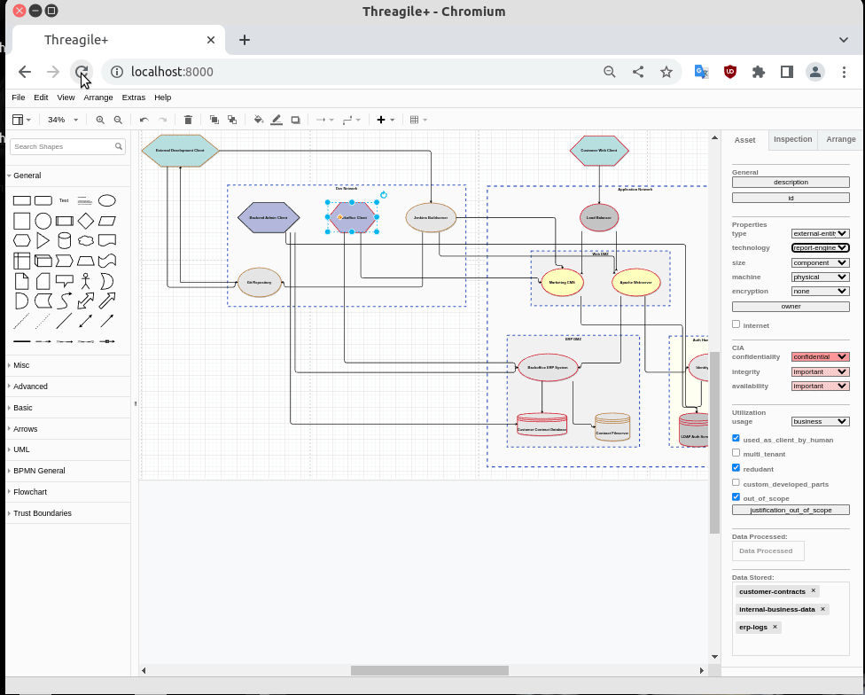

<p align="center">
  
</p>


# Threagile Plus

Welcome to Threagile Plus! This open-source project aims to enhance your experience with threat modeling.



# Project Status

The current state of this project is somewhat challenging. At this point in time, the codebase contains a considerable number of bugs that need attention.

I find myself unable to dedicate the required time to address these bugs promptly. 

## Getting Started

To start using Threagile Plus, follow these steps:

1. Switch to the cloned repository directory:
    ```bash
    cd path/to/cloned_repo
    ```
2. Launch the server using Python:
    ```bash
    python3 -m http.server
    ```
3. Open your web browser and navigate to `http://localhost:8000`.

4. Click on **File** -> **Import** -> **Browse**. Select your `Threagile.yaml` file and click **Import**.

## Technical Details

Threagile Plus is built upon JGraph (also known as [mxGraph](https://github.com/jgraph/mxgraph)) and [Threagile](https://github.com/Threagile/threagile), which was compiled to WebAssembly (WASM). The combination of these technologies allows for an enhanced and intuitive experience with threat modeling.

## Privacy and Security

I understand the importance of privacy and security, especially when it comes to something as critical as threat modeling. I want to assure you that your threat models are not being sent anywhere.

This application is purely static JavaScript. All processing is done locally on your machine, and no data is sent out. You can verify this yourself by inspecting the network traffic in your browser. Additionally, for enhanced security, you could use a Linux firewall like OpenSnitch or corresponding firewalls on other operating systems to monitor and control outgoing connections, ensuring that no data is inadvertently transmitted.

## TODOs for Testing

### General Tests:
- **Technical Assets:**
  - Test everything.
  
- **Data Asset:**
  - Configuration:
    - Tag
    - Dropdown menu
    - Buttons, e.g., description

- **Trust Boundary:**
  - Configuration:
    - Button
    - Dropdown
    - Move elements in and out

- **Connections:**
  - Use JavaScript to click on an edge and verify the values.

- Check if risk assessments are read-only.
- Verify that changes in ID update the corresponding values across:
  - Data Assets
  - Technical Assets

- Test the display of titles in data assets.

### Graph Creation Testing:
- Test creating a graph from scratch with dummy values (e.g., business criticality labeled as "foo").
  - Ensure new elements in the graph create corresponding entries in technical assets.
  - Verify the same for data assets and edges.

### Bugs:
- [Resolved] GitHub Pages common.js is not loaded correctly due to mxgraph seeking CSS from `/src/` instead of `/ThreagilePlus`.

### Additional TODOs:
- Add titles to data assets and technical assets.
- Implement a gauge to display the number of risks mitigated.

### Considerations:
- Explore strategies for handling changes in trust boundaries.
